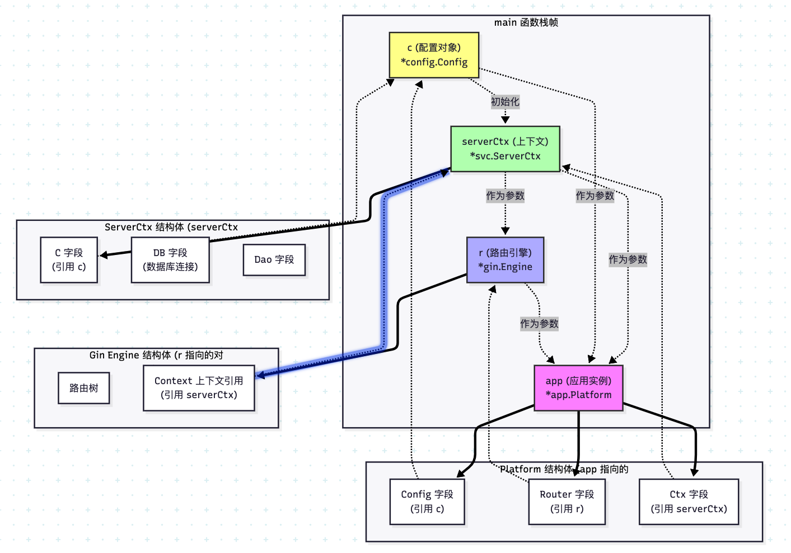

```go

	// 创建服务上下文，初始化所需的服务组件
	serverCtx, err := svc.NewServiceContext(c)
	if err != nil {
		// 如果服务上下文创建失败，程序终止并打印错误信息
		panic(err)
	}
	// Initialize router
	r := router.NewRouter(serverCtx)
	app, err := app.NewPlatform(c, r, serverCtx)
	if err != nil {
		panic(err)
	}
	app.Start()

```


这段代码展示了一个典型的 Go Web 服务启动流程，涉及依赖注入和对象组装。我们来详细分析其中的变量 `r`、`router`、`app`、`ServerCtx`、`c` 之间的关系，并画出关系图。

### 1. 变量与对象含义解析

首先，我们需要明确代码中每个标识符代表的具体含义：

*   **`serverCtx`**:
    *   **类型**：`*svc.ServerCtx`（基于之前的上下文）。
    *   **含义**：这是**全局上下文对象**。它包含了程序运行所需的所有核心依赖（如 `DB` 数据库连接、`Config` 配置、`Dao` 数据访问层、`KvStore` Redis连接等）。它是整个项目的“依赖容器”。
*   **`r`**:
    *   **类型**：`*gin.Engine`。
    *   **含义**：这是 **HTTP 路由引擎实例**。它负责定义 URL 路径与处理函数的映射关系（如 `/api/user` 对应哪个函数）。
*   **`router`**:
    *   **含义**：这通常是一个**包名**（`router` 包）。`router.NewRouter(...)` 是这个包提供的构造函数。
*   **`c`**:
    *   **类型**：`*config.Config`。
    *   **含义**：这是**配置对象**。它包含从 `config.toml` 读取的配置信息（如端口号、数据库 DSN 等）。
*   **`app`**:
    *   **类型**：`*app.Platform`。
    *   **含义**：这是**应用程序的核心实例**（通常称为 `Server` 或 `Platform`）。它是整个服务的入口控制器，聚合了路由、配置和上下文，并负责启动服务。

### 2. 它们之间的关系

这段代码展示了**依赖注入**的过程：

1.  **`r` 依赖 `serverCtx`**：
    *   创建路由时，需要传入 `serverCtx`。这是因为路由注册的处理函数可能需要访问数据库或配置，而这些都在 `serverCtx` 里。
    *   *关系*：**持有关系**。路由 `r` 内部会引用 `serverCtx`，以便在处理请求时使用。

2.  **`app` 依赖 `c`、`r`、`serverCtx`**：
    *   创建平台实例 `app` 时，传入了配置 `c`、路由 `r` 和上下文 `serverCtx`。
    *   *关系*：**组合关系**。`app` 拥有 `c`、`r` 和 `serverCtx` 作为其成员变量。

3.  **`serverCtx` 依赖 `c`**：
    *   虽然 `NewPlatform` 同时接收了 `c` 和 `serverCtx`，但通常 `serverCtx` 内部已经持有 `c`（即 `serverCtx.C == c`）。
    *   *关系*：**包含关系**。`ServerCtx` 结构体内部通常有一个字段 `C *config.Config`。

### 3. 关系图

下图展示了这些对象在内存中的引用关系。箭头 `A --> B` 表示 `A` 持有 `B` 的引用（指针）。



### 4. 详细流程分析

1.  **`r := router.NewRouter(serverCtx)`**
    *   **动作**：调用 `router` 包的 `NewRouter` 函数。
    *   **参数**：传入 `serverCtx`。
    *   **结果**：返回一个初始化好的 Gin 引擎 `r`。
    *   **内部逻辑**：在 `NewRouter` 内部，会根据 `serverCtx` 中的配置（如中间件开关）来设置 `r`，并注册路由。此时，`r` 内部可能通过闭包捕获了 `serverCtx`，或者将其存储在上下文中，以便后续 Handler 使用。

2.  **`app, err := app.NewPlatform(c, r, serverCtx)`**
    *   **动作**：调用 `app` 包的 `NewPlatform` 构造函数。
    *   **参数**：传入配置 `c`、路由 `r` 和上下文 `serverCtx`。
    *   **结果**：返回一个初始化好的 `Platform` 实例 `app`。
    *   **内部逻辑**：
        *   `app` 结构体内部会有字段，如 `config *config.Config`，`router *gin.Engine`，`svcCtx *svc.ServerCtx`。
        *   构造函数将这些传入的参数赋值给 `app` 的字段。
        *   此时，`app` 持有了 `c`、`r` 和 `serverCtx` 的引用。

3.  **`app.Start()`**
    *   **动作**：调用 `app` 实例的 `Start` 方法。
    *   **内部逻辑**：
        *   `Start` 方法会访问 `app.router`（即 `r`）。
        *   调用 `r.Run(...)` 启动 HTTP 监听。
        *   端口信息通常来自 `app.config`（即 `c`）或 `app.svcCtx.C`。

### 5. 总结

*   **`serverCtx`** 是**核心依赖库**，包含 DB、Config 等。
*   **`r` (Router)** 是**流量入口**，它依赖 `serverCtx` 来处理业务逻辑。
*   **`app` (Platform)** 是**组装者/控制器**，它将 Config、Router 和 Context 组装在一起，并启动服务。
*   **`c` (Config)** 是**静态配置**，被 `serverCtx` 和 `app` 同时持有。

这种设计模式使得依赖关系非常清晰，便于测试（例如可以传入 Mock 的 `serverCtx`）和扩展。