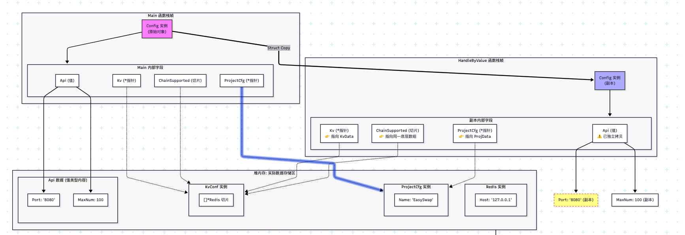
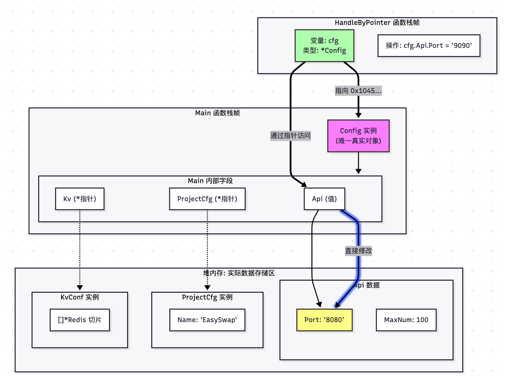

- [Config配置类传值与传引用内存布局图](#config配置类传值与传引用内存布局图) 
		- [1. 核心内存布局图解](#1-核心内存布局图解) 
		- [1. 场景一：传值](#1-场景一传值) 
			- [关键点（传值）：](#关键点传值) 
		- [2. 场景二：传指针](#2-场景二传指针) 
			- [关键点（传指针）：](#关键点传指针) 
		- [详细解析](#详细解析) 
			- [1. Api 的位置：](#1-api-的位置) 
			- [2.字符串 `Port` 的位置：](#2字符串-port-的位置) 
			- [3.指针字段 (ProjectCfg 等)：](#3指针字段-projectcfg-等) 

# Config配置类传值与传引用内存布局图

[引用的Config文件](../config/config.go)

这是一个非常典型的 Go 语言结构体内存布局问题。为了清晰展示，我将 `Config` 对象拆解为 **栈上的结构体** 和 **堆上的引用数据** 两部分，并对比 **传值** 和 **传指针** 的区别。

### 1. 核心内存布局图解

这张图展示了 `Config` 对象在内存中的真实样子。
*   **蓝色框**：代表在栈上分配的结构体本身。
*   **黄色框**：代表在堆上分配的数据（字符串、切片底层数组、引用的对象）。
*   **实线箭头**：代表结构体内部字段直接持有数据。
*   **虚线箭头**：代表指针指向堆上的数据。

好的，为了模拟真实场景，我们假设 `main` 函数中初始化了一个 `Config` 实例，并分别调用 `HandleByValue`（传值）和 `HandleByPointer`（传指针）两个函数。

为了清晰展示，我将内存分为 **Main 栈帧**、**函数栈帧** 和 **堆内存** 三个区域。

### 1. 场景一：传值

#### 关键点（传值）：
- Main 栈：包含完整的 Config 结构体，其中 Api 是嵌入的，直接占用内存。
- Func 栈：包含 Config 的完整副本。注意 Api 字段也被物理拷贝了一份。
- 堆：存储字符串的实际内容（如 "8080"）【问题：string值类型，为什么是在堆上？】，栈上的 Port 字段通过指针指向这里。

> 问题： go中值类型、引用类型，与分配在堆中还是栈中有关系么？
---

### 2. 场景二：传指针

#### 关键点（传指针）：
- Func 栈：非常小，只存了一个 8 字节的指针变量 cfg_ptr。
- Main 栈：依然是唯一的 Config 实例所在地。
- 操作：函数内部通过 cfg_ptr 直接读写 Main 栈上的内存。

### 详细解析
#### 1. Api 的位置：

- 在两张图中，`Api` 结构体都位于 `Config` 结构体的`起始位置`（因为它是第一个字段）。
- 它由 `Port (16字节)` 和 `MaxNum (8字节)` 组成，总共 24 字节。
- 传值时：这 24 字节被完整复制到了 `FuncStack` 中。
- 传指针时：这 24 字节保留在 `MainStack` 中，`FuncStack` 只有一个指针指向它。

#### 2.字符串 `Port` 的位置：

- Port 字段在栈上（属于 Api 的一部分），但它包含一个指向堆的指针。
- 传值时，虽然 Port 字段本身（指针+长度）被复制了，但指针指向的堆数据（"8080"）是共享的。
- 这意味着：如果你修改 Port 字符串（Go 中字符串不可变，通常是重新赋值），栈上的指针会改变，指向堆上的新字符串。

#### 3.指针字段 (ProjectCfg 等)：

- 它们在栈上只占用 8 字节。
- 无论传值还是传指针，它们存储的地址值都是一样的，都指向堆上的同一个对象。

> 这张图准确反映了 Go 语言中结构体嵌入、值拷贝和指针引用的内存模型。