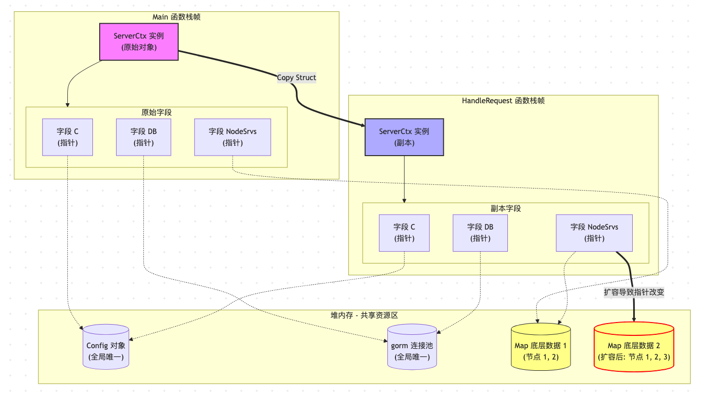
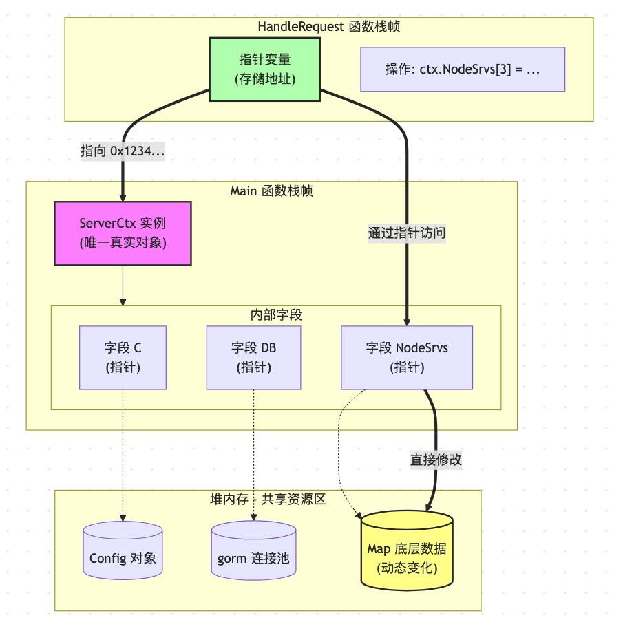

- [问题：分析ServerCtx传值和传指针，内部字段的内存情况？](#问题分析serverctx传值和传指针内部字段的内存情况)<br>
		- [1. 字段生命周期分析](#1-字段生命周期分析)<br>
			- [A. `C *config.Config` (指针)](#a-c-configconfig-指针)<br>
			- [B. `DB *gorm.DB` (指针)](#b-db-gormdb-指针)<br>
			- [C. `KvStore *xkv.Store` (指针)](#c-kvstore-xkvstore-指针)<br>
			- [D. `Dao *dao.Dao` (指针)](#d-dao-daodao-指针)<br>
			- [E. `NodeSrvs map[int64]*nftchainservice.Service` (map)](#e-nodesrvs-mapint64nftchainserviceservice-map)<br>
			- [F. `RankKey string` (值类型)](#f-rankkey-string-值类型)<br>
		- [2. 传值 vs 传指针：后果对比](#2-传值-vs-传指针后果对比)<br>
			- [场景一：使用值传递 `ctx ServerCtx`](#场景一使用值传递-ctx-serverctx)<br>
			- [场景二：使用指针传递 `ctx *ServerCtx`](#场景二使用指针传递-ctx-serverctx)<br>
		- [3. 总结与建议](#3-总结与建议)<br>
- [给出内存布局图](#给出内存布局图)<br>
		- [场景设定](#场景设定)<br>
		- [1. 传值](#1-传值)<br>
			- [图解分析：](#图解分析)<br>
		- [2. 传指针](#2-传指针)<br>
			- [图解分析：](#图解分析-1)<br>
		- [3. 总结对比表](#3-总结对比表)<br>


# 问题：分析ServerCtx传值和传指针，内部字段的内存情况？
```go
type ServerCtx struct {
	C *config.Config // 设置为main开始初始化的配置对象

	// NewServerCtx 填充的组件
	DB *gorm.DB // 数据库连接
	//ImageMgr image.ImageManager
	Dao      *dao.Dao   // 数据访问对象
	KvStore  *xkv.Store // 键值存储redis
	RankKey  string
	NodeSrvs map[int64]*nftchainservice.Service
}

```
针对 `ServerCtx` 这个结构体，结论非常明确：

**在函数参数传递时，必须使用指针 `*ServerCtx`，而不能使用值 `ServerCtx`。**

如果传值，会导致严重的**功能错误**（数据修改丢失）、**逻辑死锁**（数据库连接失效）和**性能问题**（大内存拷贝）。

下面从**字段生命周期**和**传值后果**两个维度详细分析。

---

### 1. 字段生命周期分析

我们逐个分析 `ServerCtx` 内部字段的生命周期特性，这决定了它们是否允许被拷贝。

#### A. `C *config.Config` (指针)
*   **类型**：指针。
*   **生命周期**：通常是**全局单例**，在 `main` 函数开始时初始化，直到程序退出才销毁。
*   **拷贝影响**：拷贝指针只是复制了内存地址（8字节），新旧两个结构体里的 `C` 都指向同一个 `Config` 对象。
*   **结论**：**传值安全**（指向的对象不变），但没必要。

#### B. `DB *gorm.DB` (指针)
*   **类型**：指针。
*   **生命周期**：长生命周期，代表一个数据库连接池，全局共享。
*   **拷贝影响**：虽然拷贝的是指针，但 `gorm.DB` 内部包含 `sync.RWMutex`（读写锁）和 `sql.DB`。
    *   **严重警告**：GORM 官方文档明确指出，`*gorm.DB` 是**并发安全**的，但前提是你传递的是**同一个指针**。虽然传值复制了指针地址看起来一样，但在某些复杂的闭包或延迟调用场景下，拷贝结构体本身可能导致内部状态管理的混淆。
*   **结论**：**必须传指针**。保持引用一致性。

#### C. `KvStore *xkv.Store` (指针)
*   **类型**：指针。
*   **生命周期**：长生命周期，代表 Redis 连接池，全局共享。
*   **拷贝影响**：同 `DB`，包含连接状态和配置。
*   **结论**：**必须传指针**。

#### D. `Dao *dao.Dao` (指针)
*   **类型**：指针。
*   **生命周期**：通常依赖 `DB` 和 `KvStore`，生命周期与它们一致。
*   **拷贝影响**：如果 `Dao` 内部有缓存（如 `map`）或状态（如 `sync.Mutex`），拷贝会导致**状态不同步**。例如，你在函数 A 中修改了 `Dao` 的某个状态，函数 B 中拿到的拷贝体依然是旧状态。
*   **结论**：**必须传指针**。

#### E. `NodeSrvs map[int64]*nftchainservice.Service` (map)
*   **类型**：引用类型（map 本身是指针的封装）。
*   **生命周期**：动态管理，运行时增删节点服务。
*   **拷贝影响**：在 Go 中，直接拷贝 map 是**非常危险**的。
    *   如果你拷贝了 map，然后在函数里向 map 里 `put` 一个新节点，**外部的原 map 是看不到这个新节点的**！因为 map 的底层指针虽然被复制了，但如果你触发了扩容，底层指针指向的数组可能会变，导致数据分离。
*   **结论**：**必须传指针**（或者传 map 的指针 `*map`），确保所有操作都在同一个 map 实例上。

#### F. `RankKey string` (值类型)
*   **类型**：基本类型。
*   **生命周期**：随结构体。
*   **拷贝影响**：字符串是只读的，拷贝成本很低（只是拷贝指针和长度）。
*   **结论**：传值安全。

---


### 2. 传值 vs 传指针：后果对比

假设我们有一个处理请求的 Handler：

```go
// 假设这是你的 Handler
func SomeHandler(ctx ServerCtx) { // 注意：这里传的是值
    // 1. 修改配置里的某个值（假设 Config 允许修改）
    ctx.C.Mode = "debug" 

    // 2. 向 NodeSrvs 里注册一个新节点
    ctx.NodeSrvs[101] = newService
    
    // 3. 使用 DB 查询
    ctx.DB.Find(...)
}
```

#### 场景一：使用值传递 `ctx ServerCtx`

1.  **内存开销**：
    *   发生了一次**结构体拷贝**。
    *   `map` 和 `*DB` 等虽然只是复制了头部信息，但 `ServerCtx` 结构体本身如果很大（或者因为内存对齐），拷贝会有微小的性能损耗。

2.  **数据一致性灾难（核心问题）**：
    *   **Map 修改丢失**：当你执行 `ctx.NodeSrvs[101] = ...` 时，你实际上是在**拷贝出来的 map** 上操作。函数结束后，原始的 `ServerCtx` 里的 `NodeSrvs` **依然是空的**（或者没有 101 这个节点）。这会导致你的节点注册逻辑完全失效。
    *   **状态不同步**：如果 `Dao` 或其他组件内部有计数器或缓存，拷贝会导致状态分裂。

3.  **潜在风险**：
    *   虽然拷贝了 `*gorm.DB` 指针，但如果你在函数里对 `ctx.DB` 进行了重新赋值（比如 `ctx.DB = ctx.DB.Debug()`），外部是感知不到这个变化的。

#### 场景二：使用指针传递 `ctx *ServerCtx`

1.  **内存开销**：
    *   只拷贝了 8 字节（64位系统）的指针。**性能最优**。

2.  **数据一致性**：
    *   **Map 生效**：`ctx.NodeSrvs[101] = ...` 直接修改原始 map，全局生效。
    *   **状态同步**：所有修改都在同一个对象上。

3.  **标准做法**：
    *   符合 Go 语言惯用法。对于这种“上下文”或“大结构体”，默认都是传指针。

---

### 3. 总结与建议

| 字段名 | 类型 | 传值安全性 | 建议传参方式 |
| :--- | :--- | :--- | :--- |
| `C` | `*config.Config` | 安全（指向同一对象） | 指针 |
| `DB` | `*gorm.DB` | 风险（状态管理混乱） | **指针 (必须)** |
| `KvStore`| `*xkv.Store` | 风险（连接池状态） | **指针 (必须)** |
| `Dao` | `*dao.Dao` | 风险（状态/缓存不同步） | **指针 (必须)** |
| `NodeSrvs`| `map` | **危险 (修改丢失)** | **指针 (必须)** |
| `RankKey`| `string` | 安全 | 指针 (随整体) |

**最终建议**：

永远使用 **指针** 传递 `ServerCtx`。

```go
// ✅ 正确
func (p *Platform) Start() {
    // ...
}

func SomeHandler(svcCtx *svc.ServerCtx) {
    // ...
}

// ❌ 错误
func SomeHandler(svcCtx svc.ServerCtx) {
    // ...
}
```

**理由**：
1.  **Map 修改**：`NodeSrvs` 是 map，传值会导致写入丢失。
2.  **性能**：结构体拷贝比指针拷贝慢。
3.  **一致性**：确保所有组件看到的是同一个上下文状态。

# 给出内存布局图

为了直观展示 `ServerCtx` 在**传值**和**传指针**时的内存布局差异，我画了以下两张对比图。

### 场景设定
假设我们在 `main` 函数中有一个全局的 `ServerCtx` 实例，我们将它传递给一个函数 `HandleRequest`。

---

### 1. 传值

当你使用 `func HandleRequest(ctx svc.ServerCtx)` 时，发生了**深拷贝**。




#### 图解分析：
1.  **双倍内存占用**：栈上现在有两个 `ServerCtx` 结构体实例。
2.  **指针指向相同**：虽然结构体被复制了，但里面的指针（`C`, `DB`, `NodeSrvs`）依然指向堆上同一个对象。
3.  **致命风险（Map 扩容）**：
    *   如果你在 `HandleRequest` 中执行 `ctx.NodeSrvs[3] = newService`，且触发了 Map 扩容。
    *   **副本** 里的 `NodeSrvs` 指针会指向**新的**堆内存（MapData 2）。
    *   **原始** `GlobalCtx` 里的 `NodeSrvs` 依然指向**旧的**堆内存（MapData 1）。
    *   **结果**：你的修改丢失了，主流程感知不到新节点。

---

### 2. 传指针

当你使用 `func HandleRequest(ctx *svc.ServerCtx)` 时，只复制了地址。




#### 图解分析：
1.  **极低开销**： 函数栈中只有一个指针变量 Ptr(`8 字节（64位系统）`)，它指向 MainStack 中的 GlobalCtx。
2.  **唯一真实源**：无论在哪个函数里操作，都是直接修改 `MainStack` 里的那个 `GlobalCtx`。
3.  **数据一致性**：
    *   `ctx.NodeSrvs[3] = newService` 直接修改堆上的 `MapData`。
    *   所有地方看到的都是最新的数据。

---

### 3. 总结对比表

| 特性 | 传值 (`ServerCtx`) | 传指针 (`*ServerCtx`) |
| :--- | :--- | :--- |
| **拷贝内容** | 整个结构体 (所有字段) | 仅内存地址 (8 字节) |
| **栈内存消耗** | 大 (结构体大小) | 极小 (8 字节) |
| **Map/Slice 修改** | **可能丢失** (触发扩容时) | **安全** (直接修改源数据) |
| **内部指针** | 指向相同的堆对象 (Config, DB) | 指向相同的堆对象 |
| **适用场景** | 小结构体、只读操作 | **上下文对象、大结构体、需修改状态** |

**结论**：对于 `ServerCtx` 这种包含 Map、数据库连接且需要全局共享状态的上下文对象，**必须使用指针传递**。