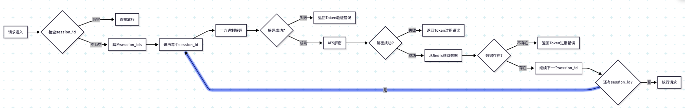

- [auth.go 中间件运行流程分析](#authgo-中间件运行流程分析)
	- [1. 核心流程图](#1-核心流程图)
	- [2. 详细流程说明](#2-详细流程说明)
		- [2.1 初始检查](#21-初始检查)
		- [2.2 Session处理](#22-session处理)
		- [2.3 验证步骤](#23-验证步骤)
		- [2.4 辅助函数](#24-辅助函数)
			- [GetAuthUserAddress](#getauthuseraddress)
			- [AesDecryptOFB](#aesdecryptofb)
	- [3. 安全特性](#3-安全特性)

# auth.go 中间件运行流程分析

## 1. 核心流程图

## 2. 详细流程说明

### 2.1 初始检查
- 从请求头获取 `session_id`
- 如果为空，直接放行请求
- 如果不为空，继续验证流程

### 2.2 Session处理
- 支持多个session_id，用逗号分隔
- 对每个session_id执行相同的验证流程

### 2.3 验证步骤
1. **十六进制解码**
   - 将session_id从十六进制字符串转换为字节
   - 失败则返回 `ErrTokenVerify`

2. **AES解密**
   - 使用 `CR_LOGIN_SALT` 作为密钥
   - 使用OFB模式解密
   - 失败则返回 `ErrTokenExpire`

3. **Redis验证**
   - 用解密后的key从Redis获取数据
   - 数据不存在则返回 `ErrTokenExpire`

### 2.4 辅助函数

#### GetAuthUserAddress
- 用于获取已认证用户的地址列表
- 同样经过解码和解密过程
- 返回所有有效的用户地址

#### AesDecryptOFB
- 实现AES-OFB模式解密
- 包含PKCS7反填充处理
- 确保数据长度正确

## 3. 安全特性

1. **多层加密**
   - 十六进制编码
   - AES加密
   - 固定盐值

2. **会话管理**
   - Redis存储会话信息
   - 支持多设备登录
   - 会话过期自动失效

3. **错误处理**
   - 区分不同类型的错误
   - 统一的错误响应格式
   - 详细的错误日志记录

这个中间件设计确保了API的安全性，同时保持了良好的用户体验。