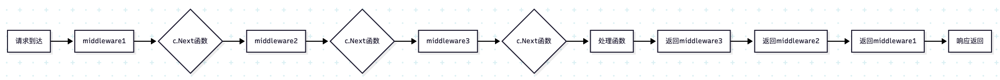

# c.Next() 的作用和原理

## 1. 基本功能
`c.Next()` 是 Gin 框架中的核心方法，用于控制中间件链的执行流程。

## 2. 执行机制

### 2.1 中间件执行顺序
```go
// 中间件注册顺序
router.Use(middleware1)
router.Use(middleware2)
router.Use(middleware3)
```

### 2.2 执行流程



## 3. 在代码中的具体应用

### 3.1 AuthMiddleware 中的使用
```go
func AuthMiddleWare(ctx *xkv.Store) gin.HandlerFunc {
    return func(c *gin.Context) {
        // 验证逻辑...
        
        c.Next() // 继续执行后续中间件和处理函数
        return
    }
}
```

### 3.2 RecoverMiddleware 中的使用
```go
func RecoverMiddleware() gin.HandlerFunc {
    return func(c *gin.Context) {
        defer func() {
            // 恢复逻辑...
        }()
        
        c.Next() // 继续执行后续中间件和处理函数
    }
}
```

## 4. 关键特性

### 1. **执行控制**【`重点说明`】
   - 调用 `c.Next()` 会暂停当前中间件，继续执行后续中间件
   - 后续中间件执行完后，会返回到当前中间件的 `c.Next()` 之后继续执行

### 2. **中断处理**
   - 使用 `c.Abort()` 可以中断中间件链的执行
   - 中断后不会执行后续中间件和处理函数

### 3. **上下文传递**
   - 通过 `c.Set()` 和 `c.Get()` 在中间件间传递数据
   - 数据在整个请求生命周期内可用

## 5. 注意事项

### 1. **调用位置**
   - `c.Next()` 应该在中间件逻辑处理完成后调用
   - 不要在 defer 中调用 `c.Next()`

### 2. **多次调用**
   - 在同一个中间件中多次调用 `c.Next()` 可能导致意外行为
   - 通常每个中间件只调用一次 `c.Next()`

### 3. **错误处理**
   - 在 `c.Next()` 之前设置错误处理
   - 使用 `c.Errors` 收集处理过程中的错误

`c.Next()` 是 Gin 中间件机制的核心，它实现了中间件的链式调用，使得请求处理流程更加灵活和可控。