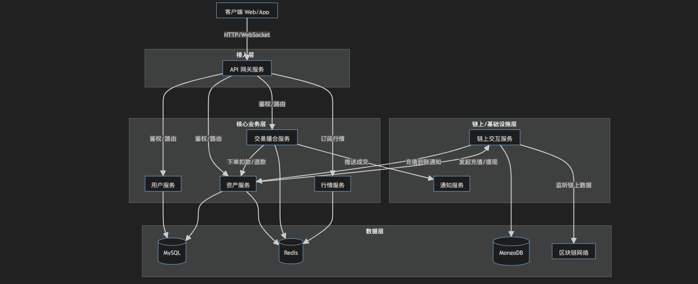

- [1. 核心业务服务拆分](#1-核心业务服务拆分)
  - [A. 用户服务](#a-用户服务)
  - [B. 资产服务](#b-资产服务)
  - [C. 链上交互服务](#c-链上交互服务)
  - [D. 交易撮合服务](#d-交易撮合服务)
  - [E. 行情/数据服务](#e-行情数据服务)
- [2. 基础设施/支撑服务拆分](#2-基础设施支撑服务拆分)
  - [F. 网关服务](#f-网关服务)
  - [G. 通知服务](#g-通知服务)
- [3. 拆分后的交互关系图](#3-拆分后的交互关系图)
- [4. 针对您现有代码的具体建议](#4-针对您现有代码的具体建议)
- [总结](#总结)

基于常见的 Web 后端架构模式以及您之前提供的代码片段（包含 `UserMultiChainCollectionsHandler`、`gorm`、`xkv`、`dao` 等关键词），我们可以推断 **EasySwapBackend** 是一个涉及 **区块链数据、用户资产、交易撮合** 的中心化或混合型交易所后端。

对于此类系统，为了提高开发效率、系统可扩展性和稳定性，可以按照 **业务领域** 和 **技术职责** 进行微服务拆分。以下是建议的拆分方案：

### 1. 核心业务服务拆分

这是最常见的拆分维度，按照业务功能模块进行划分。

#### A. 用户服务
*   **职责**：负责用户账号体系、身份认证、权限管理。
*   **核心功能**：
    *   注册、登录（邮箱、手机号、Google Authenticator）。
    *   JWT Token 颁发与校验。
    *   用户资料管理（KYC 认证、安全设置）。
    *   API Key 管理（用于 API 调用）。
*   **数据存储**：MySQL (用户基础信息), Redis (Session/Token 黑名单)。

#### B. 资产服务
*   **职责**：管理用户的资产余额、冻结资金、充值提现记录。
*   **核心功能**：
    *   查询用户各链余额（ETH, BSC, SOL 等）。
    *   资产冻结/解冻（下单时冻结，成交/撤单时解冻）。
    *   充值地址管理。
    *   提现审核与风控校验。
*   **数据存储**：MySQL (资产流水), Redis (热点用户余额缓存)。

#### C. 链上交互服务
*   **职责**：作为系统与区块链网络的“网关”，处理所有与链交互的繁重任务。
*   **核心功能**：
    *   监听链上事件（区块、交易回执）。
    *   处理充值（监听入账交易）。
    *   发送提现交易（构建、签名、广播）。
    *   调用链上合约（Swap, NFT 交互）。
*   **特点**：此服务极度依赖 RPC 节点稳定性，通常需要单独部署，避免阻塞主业务。
*   **数据存储**：MongoDB (存储链上原始交易数据), Redis (Pending 交易池)。

#### D. 交易撮合服务
*   **职责**：处理订单撮合逻辑，这是交易所的核心。
*   **核心功能**：
    *   限价单、市价单的下单与撤销。
    *   撮合引擎（匹配买卖盘）。
    *   成交记录生成。
*   **技术特点**：对性能要求极高，通常使用内存数据库撮合，异步持久化到 MySQL。
*   **数据存储**：Redis (订单簿), MySQL (成交历史)。

#### E. 行情/数据服务
*   **职责**：提供 K 线、深度图、最新成交价等市场数据。
*   **核心功能**：
    *   聚合各交易对的实时价格。
    *   计算 K 线（1m, 5m, 1h 等）。
    *   通过 WebSocket 推送实时行情给前端。
*   **数据存储**：Redis (最新价格), ClickHouse/TimescaleDB (历史 K 线，适合时序数据)。

### 2. 基础设施/支撑服务拆分

除了核心业务，还需要一些支撑服务来解耦系统。

#### F. 网关服务
*   **职责**：系统的统一入口，代替您代码中的 `NewRouter`。
*   **核心功能**：
    *   路由转发（将 `/api/user` 发给 User Service，`/api/order` 发给 Trade Service）。
    *   统一鉴权（校验 Token，解析 User ID 并透传给下游）。
    *   限流、熔断、防刷。
    *   CORS 配置（您代码中的 `cors.New`）。

#### G. 通知服务
*   **职责**：统一处理触达用户的消息。
*   **核心功能**：
    *   站内信。
    *   邮件发送。
    *   短信发送。
    *   WebSocket 推送（如订单成交通知）。

---

### 3. 拆分后的交互关系图

### 4. 针对您现有代码的具体建议

您提供的代码中包含 `UserMultiChainCollectionsHandler`，这表明目前可能是一个“单体”应用，混合了用户逻辑和链上逻辑。

1.  **第一步（物理分离，逻辑未分）**：
    *   保持代码库不变，但将部署单元拆分。
    *   例如：启动两个进程，一个只跑 `User` 相关的 Handler，一个只跑 `Chain` 相关的 Handler。
    *   共用同一个 MySQL 数据库。

2.  **第二步（接口分离）**：
    *   将 `UserMultiChainCollectionsHandler` 中的链上查询逻辑剥离出来，定义一个 gRPC 或 HTTP 接口。
    *   User 服务不再直接连区块链节点，而是调用 Chain 服务。

3.  **第三步（数据库分离）**：
    *   当服务独立稳定后，开始拆分数据库。
    *   User 服务拥有自己的 `user_db`，Chain 服务拥有自己的 `chain_db`。

### 总结

对于 EasySwapBackend，最优先拆分的建议是：
1.  **网关服务**：解决鉴权和路由混乱问题。
2.  **链上交互服务**：隔离区块链 RPC 的不稳定性和资源消耗。
3.  **交易撮合服务**：隔离核心的高并发计算逻辑。